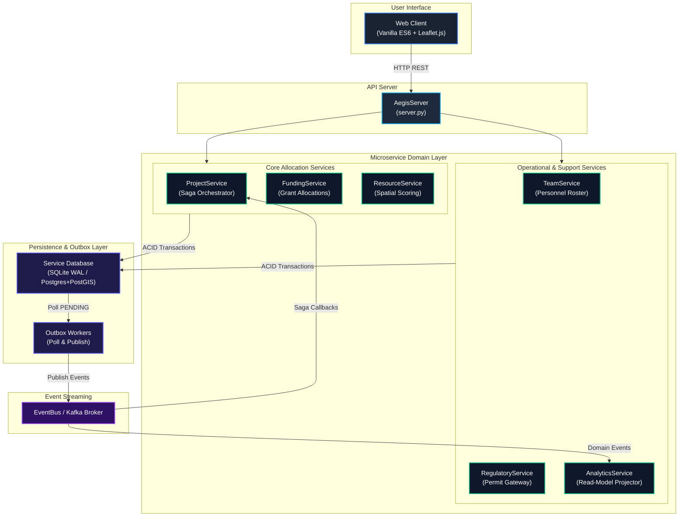

<div align="center">

# ECOTONE ATLAS

### **Geospatial Field Operations & Distributed Saga Engine**

[](https://python.org)
[](https://postgresql.org)
[](https://postgis.net)
[](https://kafka.apache.org)
[](https://leafletjs.com)
[](LICENSE)

</div>

<br />

---

## 🧭 Overview

**ECOTONE** is a geospatial field operations platform designed to plan, resource, authorize, and observe scientific research expeditions in sensitive ecological transition zones (focused on the Western Ghats / Sahyadri region in Maharashtra, India).

The system integrates spatial constraint evaluation with an **Event-Driven Orchestrated Saga Pattern** and **Transactional Outbox Processing** to manage dependencies across grant budgets, equipment dispatch, field specialist allocations, and regulatory permit clearances.

If an operation encounters a failure during execution (such as an environmental permit rejection over a protected forest zone), ECOTONE executes a multi-service compensation cascade to release reserved grant budgets, unassign personnel, and return equipment to available status.

<br />

---

## ⚙️ System Capabilities

| 🗺️ **Geospatial Scoring & Constraints** | 🔄 **Saga Orchestration** |
|---|---|
| • **Composite Scoring:** Evaluates asset distance, transport time, battery level, workload, and priority.<br><br>• **Spatial Boundaries:** PostGIS `ST_Intersects` and bounding-box queries for restricted zones.<br><br>• **Geodesic Distance:** Haversine formula routing for remote outpost logistics. | • **Forward Execution:** 4-stage pipeline (`FUNDING` ➔ `RESOURCES` ➔ `TEAM` ➔ `PERMITS` ➔ `ACTIVE`).<br><br>• **Compensation Cascade:** Parallel rollback of locked grants, drones, and personnel on rejection.<br><br>• **Idempotency Claims:** Deduplication via `INSERT OR IGNORE INTO processed_events`. |
| 📦 **Transactional Outbox** | 🔍 **System Observability** |
| • **Atomic DB Writes:** Domain updates and outbox payloads committed in one transaction block.<br><br>• **At-Least-Once Delivery:** Worker process polls `PENDING` outbox rows and publishes to broker.<br><br>• **Crash Recovery:** Un-sent outbox events survive crashes and automatically replay on restart. | • **Saga Flow Visualizer:** 6-stage timeline renderer showing step execution & failure states.<br><br>• **Service Trace Matrix:** Execution step log annotated with Operation IDs (`OP_ID: 3afcc79d`).<br><br>• **Live Event Stream:** Real-time event log with instant filtering by operation ID and event type. |

<br />

---

## 🎨 Architectural Pipeline

<br />



<br />

---

## 🚦 Saga Execution Matrix

<br />

<table width="100%" cellpadding="10" cellspacing="0">
  <thead>
    <tr align="center">
      <th width="10%">Step</th>
      <th width="20%">State</th>
      <th width="30%">Trigger / Event</th>
      <th width="25%">Result Path</th>
      <th width="15%">Status Tag</th>
    </tr>
  </thead>
  <tbody>
    <tr>
      <td align="center"><b>01</b></td>
      <td><code>STEP_1_FUNDING</code></td>
      <td><code>COMMAND_RESERVE_FUNDS</code></td>
      <td>Grant budget reserved</td>
      <td align="center"><code>IN_PROGRESS</code></td>
    </tr>
    <tr>
      <td align="center"><b>02</b></td>
      <td><code>STEP_2_RESOURCES</code></td>
      <td><code>COMMAND_RESERVE_RESOURCES</code></td>
      <td>Equipment scored and locked</td>
      <td align="center"><code>IN_PROGRESS</code></td>
    </tr>
    <tr>
      <td align="center"><b>03</b></td>
      <td><code>STEP_3_TEAM</code></td>
      <td><code>COMMAND_ASSIGN_TEAM</code></td>
      <td>Field personnel assigned</td>
      <td align="center"><code>IN_PROGRESS</code></td>
    </tr>
    <tr>
      <td align="center"><b>04</b></td>
      <td><code>STEP_4_PERMITS</code></td>
      <td><code>COMMAND_REQUEST_PERMIT</code></td>
      <td>Permit clearance granted</td>
      <td align="center"><code>IN_PROGRESS</code></td>
    </tr>
    <tr>
      <td align="center"><b>05</b></td>
      <td><code>COMPENSATING</code></td>
      <td><code>COMMAND_RELEASE_*</code></td>
      <td>Parallel release of grants and assets</td>
      <td align="center"><code>COMPENSATING</code></td>
    </tr>
    <tr>
      <td align="center"><b>06</b></td>
      <td><code>TERMINAL</code></td>
      <td><code>PROJECT_ACTIVATED</code> / <code>CANCELLED</code></td>
      <td>Operation active or fully compensated</td>
      <td align="center"><code>ACTIVE</code> / <code>CANCELLED</code></td>
    </tr>
  </tbody>
</table>

<br />

---

## ⚡ Setup & Execution

### Local Mode (Standard Library)

Run locally using standard Python libraries:

```bash
# Clone repository
git clone https://github.com/your-org/ecotone.git
cd ecotone

# Seed sample operations
python scripts/seed_operations.py

# Start application server
python server.py 8080
```

Access the Web UI at `http://localhost:8080`.

<br />

### Container Mode (PostgreSQL + PostGIS + Kafka)

Run with Docker dependencies enabled:

```bash
# Launch PostgreSQL & Kafka
docker-compose up -d

# Setup database schemas
python scripts/setup_postgres_db.py

# Run integration tests
python scripts/integration_chaos_tests.py
```

<br />

---

## 🧪 Fault Testing Suite

Run the in-process fault-injection test suite (`scripts/chaos_tests.py`):

```bash
python scripts/chaos_tests.py
```

<br />

<table width="100%" cellpadding="10" cellspacing="0">
  <thead>
    <tr align="center">
      <th width="8%">Test</th>
      <th width="24%">Scenario</th>
      <th width="30%">Injected Fault</th>
      <th width="28%">Observed Behavior</th>
      <th width="10%">Status</th>
    </tr>
  </thead>
  <tbody>
    <tr>
      <td align="center"><b>T1</b></td>
      <td>Outbox Recovery</td>
      <td>Process crash after DB commit before publish</td>
      <td>Worker recovers pending entry on restart</td>
      <td align="center"><code>PASS</code></td>
    </tr>
    <tr>
      <td align="center"><b>T2</b></td>
      <td>Duplicate Delivery</td>
      <td>Duplicate event delivered to subscriber</td>
      <td>Idempotency table blocks duplicate execution</td>
      <td align="center"><code>PASS</code></td>
    </tr>
    <tr>
      <td align="center"><b>T3</b></td>
      <td>Concurrent Reservation</td>
      <td>Two operations request same resource</td>
      <td>Conditional SQL update prevents double-booking</td>
      <td align="center"><code>PASS</code></td>
    </tr>
    <tr>
      <td align="center"><b>T4</b></td>
      <td>Orchestrator Crash</td>
      <td>Process killed during compensation</td>
      <td><code>recover_pending_sagas()</code> re-dispatches rollbacks</td>
      <td align="center"><code>PASS</code></td>
    </tr>
    <tr>
      <td align="center"><b>T5</b></td>
      <td>Broker Recovery</td>
      <td>Event bus reset during active saga</td>
      <td>Outbox worker replays un-sent events</td>
      <td align="center"><code>PASS</code></td>
    </tr>
    <tr>
      <td align="center"><b>T6</b></td>
      <td>Partial Compensation</td>
      <td>Single compensation step handler failure</td>
      <td>Saga remains in <code>COMPENSATING</code> state until resolved</td>
      <td align="center"><code>PASS</code></td>
    </tr>
  </tbody>
</table>

<br />

---

## 📡 REST API Reference

```http
GET /api/analytics
```
Returns summary metrics, event counts, and read-model state.

```http
GET /api/projects
```
Lists all operations with calculated asset distances, waiting days, and remaining budgets.

```http
POST /api/projects/analyze
```
Evaluates candidate equipment scores and checks PostGIS constraint violations.

```http
POST /api/projects/initiate
```
Creates a new operation record and executes the saga outbox loop.

```http
DELETE /api/projects/:id
```
Deletes an operation record and releases reserved grants, equipment, and personnel.

<br />

---

## 📂 Repository Layout

```
ecotone/
├── services/                  # Domain Microservices
│   ├── project_service.py     # Saga Orchestration
│   ├── funding_service.py     # Grant Budgets
│   ├── resource_service.py    # Spatial Resource Scoring
│   ├── team_service.py        # Personnel Assignments
│   ├── regulatory_service.py  # Permit Gateway Simulation
│   └── analytics_service.py   # Read-Model Projection
├── shared/                    # Shared Infrastructure
│   ├── database.py            # SQLite Connection & Transaction Wrapper
│   ├── pg_database.py         # PostgreSQL + PostGIS Adapter
│   ├── event_bus.py           # In-Process Event Bus
│   ├── outbox.py              # Outbox Worker Loop
│   ├── kafka_bus.py           # Kafka Event Bus Adapter
│   └── config.py              # System Configuration & Topics
├── web/                       # Single Page Application
│   ├── index.html             # Shell Layout
│   ├── styles.css             # Styling & Theme Variables
│   └── app.js                 # Router, Leaflet Integration, Views
├── scripts/                   # Test & Seeding Scripts
│   ├── seed_operations.py     # Data Seeder
│   ├── simulate_saga.py       # Integration Simulator
│   ├── chaos_tests.py         # In-Process Fault Test Suite
│   └── integration_chaos_tests.py # Container Integration Tests
├── docker-compose.yml         # Local Infrastructure Compose File
└── server.py                  # HTTP Application Server
```

<br />

---

<div align="center">

ECOTONE ATLAS • AAYUSH RAHATE

</div>
