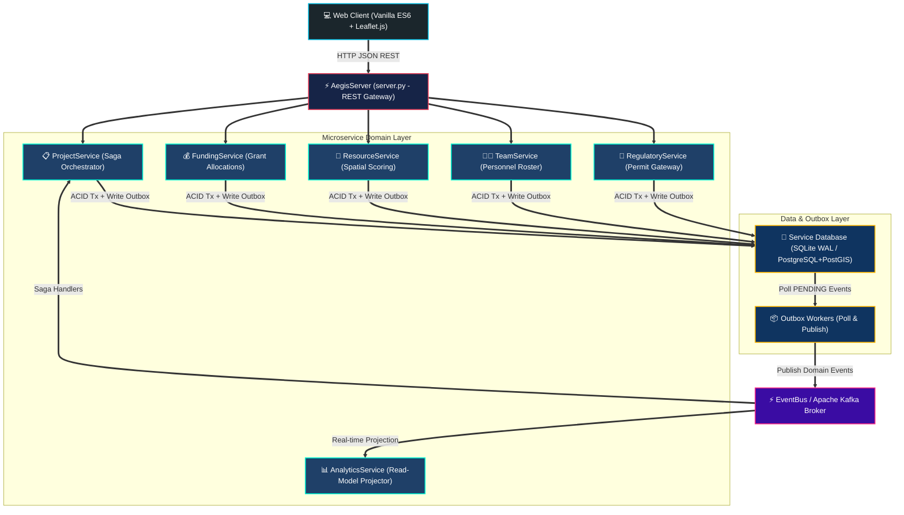

<div align="center">

# 🌿 ECOTONE ATLAS 🗺️

### **Resilient Geospatial Operations • Spatial Resource Intelligence • Distributed Saga Engine**

─────────────── 🍃 ───────────────

[](https://python.org)
[](https://postgresql.org)
[](https://postgis.net)
[](https://kafka.apache.org)
[](https://leafletjs.com)
[](#-chaos-engineering--fault-simulation-suite)
[](LICENSE)

</div>

<br />

---

## 🧭 Overview

**ECOTONE** is an enterprise-grade geospatial field operations platform designed to plan, resource, authorize, and observe high-risk scientific expeditions across sensitive ecological transition zones in the **Western Ghats / Sahyadri mountain range** (Maharashtra, India).

Unlike conventional operational tools that fail when field conditions change, ECOTONE employs an **Event-Driven Orchestrated Saga Pattern** coupled with **Transactional Outbox Processing** to ensure absolute data consistency across grant budgets, drone fleets, eDNA sequencers, field specialists, and government environmental permits.

<br />

<div align="center">

> 🚨 **Real-World Failure Resilience:** If an expedition hits a late-stage failure (e.g. a drone flight permit denied over a tiger corridor), ECOTONE instantly executes a **multi-service compensation cascade**, unlocking grant budgets, returning equipment to depots, and unassigning personnel with **zero resource leaks**.

</div>

<br />

---

## 🌈 Key Capabilities

<table width="100%" cellpadding="12" cellspacing="0">
  <tr>
    <td width="50%" valign="top">
      <h3 align="center">🗺️ Geospatial Intelligence Engine</h3>
      <ul>
        <li><b>Composite Suitability Scoring:</b> Multi-variable algorithm weighing distance, travel hours, battery levels, workload, and mission priority.</li>
        <li><b>PostGIS Spatial Constraints:</b> Direct <code>ST_Intersects</code> polygon check filtering out prohibited reserves & airspace no-fly zones.</li>
        <li><b>Haversine Routing:</b> Geodesic distance calculations for remote outpost logistics.</li>
      </ul>
    </td>
    <td width="50%" valign="top">
      <h3 align="center">🔄 Distributed Saga Orchestration</h3>
      <ul>
        <li><b>4-Stage Forward Execution:</b> <code>FUNDING</code> ➔ <code>RESOURCES</code> ➔ <code>TEAM</code> ➔ <code>PERMITS</code> ➔ <code>ACTIVATED</code>.</li>
        <li><b>Automated Rollback Cascade:</b> Parallel release of grants, drones, and specialists on permit rejection.</li>
        <li><b>Idempotency Claiming:</b> Transactional <code>INSERT OR IGNORE INTO processed_events</code> blocking duplicate deliveries.</li>
      </ul>
    </td>
  </tr>
  <tr>
    <td width="50%" valign="top">
      <h3 align="center">📦 Transactional Outbox Pattern</h3>
      <ul>
        <li><b>Atomic DB Writes:</b> Domain updates and outbox events committed in a single <code>with db.begin() as tx:</code> transaction.</li>
        <li><b>At-Least-Once Delivery:</b> Outbox workers poll <code>PENDING</code> rows and publish to Kafka/EventBus with crash-recovery replay.</li>
      </ul>
    </td>
    <td width="50%" valign="top">
      <h3 align="center">🔍 Deep Observability Console</h3>
      <ul>
        <li><b>Visual Saga Timeline:</b> Color-coded 6-stage status nodes with terminal <code>CANCELLED</code> highlight.</li>
        <li><b>Service Trace Matrix:</b> Real-time service execution logs with 8-character Operation IDs (<code>OP_ID: 3afcc79d</code>).</li>
        <li><b>Live Event Stream:</b> Instant event filter by operation ID and event type.</li>
      </ul>
    </td>
  </tr>
</table>

<br />

---

## 🎨 Architectural Pipeline

<br />



<br />

---

## 🚦 Saga State Transition Matrix

<br />

<table width="100%" cellpadding="10" cellspacing="0">
  <thead>
    <tr align="center">
      <th width="10%">Step</th>
      <th width="18%">State</th>
      <th width="28%">Action / Event</th>
      <th width="24%">Success Path</th>
      <th width="20%">Status Tag</th>
    </tr>
  </thead>
  <tbody>
    <tr>
      <td align="center"><b>01</b></td>
      <td><code>STEP_1_FUNDING</code></td>
      <td><code>COMMAND_RESERVE_FUNDS</code></td>
      <td>Grant budget locked ($350,000)</td>
      <td align="center"><span style="color:#3FA66E">🟢 IN_PROGRESS</span></td>
    </tr>
    <tr>
      <td align="center"><b>02</b></td>
      <td><code>STEP_2_RESOURCES</code></td>
      <td><code>COMMAND_RESERVE_RESOURCES</code></td>
      <td>Drones & Sequencers reserved</td>
      <td align="center"><span style="color:#3FA66E">🟢 IN_PROGRESS</span></td>
    </tr>
    <tr>
      <td align="center"><b>03</b></td>
      <td><code>STEP_3_TEAM</code></td>
      <td><code>COMMAND_ASSIGN_TEAM</code></td>
      <td>Ecologists & Drone Pilots assigned</td>
      <td align="center"><span style="color:#3FA66E">🟢 IN_PROGRESS</span></td>
    </tr>
    <tr>
      <td align="center"><b>04</b></td>
      <td><code>STEP_4_PERMITS</code></td>
      <td><code>COMMAND_REQUEST_PERMIT</code></td>
      <td>Environmental clearance granted</td>
      <td align="center"><span style="color:#3FA66E">🟢 IN_PROGRESS</span></td>
    </tr>
    <tr>
      <td align="center"><b>05</b></td>
      <td><code>COMPENSATING</code></td>
      <td><code>COMMAND_RELEASE_*</code></td>
      <td>Parallel release of grants & assets</td>
      <td align="center"><span style="color:#E8833A">🟠 COMPENSATING</span></td>
    </tr>
    <tr>
      <td align="center"><b>06</b></td>
      <td><code>TERMINAL</code></td>
      <td><code>PROJECT_ACTIVATED</code> / <code>CANCELLED</code></td>
      <td>Deployment live OR Fully compensated</td>
      <td align="center"><span style="color:#D46565">🔴 CANCELLED</span> / <span style="color:#3FA66E">🟢 ACTIVE</span></td>
    </tr>
  </tbody>
</table>

<br />

---

## ⚡ Quickstart Guide

### Option 1: Standalone Zero-Config Run 🚀

Launch the full platform instantly using Python's standard library:

```bash
# 1. Clone the repository
git clone https://github.com/your-org/ecotone.git
cd ecotone

# 2. Seed realistic operations across multiple saga states
python scripts/seed_operations.py

# 3. Start the ECOTONE Server (Port 8080)
python server.py 8080
```

🌐 **Access the UI:** Open **`http://localhost:8080`** in your browser!

<br />

### Option 2: Docker Container Stack (PostgreSQL + PostGIS + Kafka) 🐳

Launch the enterprise containerized infrastructure stack:

```bash
# 1. Spin up PostgreSQL 16.4 + PostGIS 3.4.3 & Apache Kafka 7.5.0
docker-compose up -d

# 2. Initialize PostGIS spatial tables & indexes
python scripts/setup_postgres_db.py

# 3. Run real-infrastructure chaos integration suite
python scripts/integration_chaos_tests.py
```

<br />

---

## 🧪 Chaos Engineering & Fault Simulation Suite

ECOTONE features a dedicated fault-injection testing harness (`scripts/chaos_tests.py`) proving distributed resilience across 6 extreme failure modes:

```bash
python scripts/chaos_tests.py
```

<br />

<table width="100%" cellpadding="10" cellspacing="0">
  <thead>
    <tr align="center">
      <th width="8%">ID</th>
      <th width="22%">Chaos Scenario</th>
      <th width="30%">Injected Fault</th>
      <th width="30%">Expected System Recovery</th>
      <th width="10%">Result</th>
    </tr>
  </thead>
  <tbody>
    <tr>
      <td align="center"><b>T1</b></td>
      <td><b>Outbox Recovery</b></td>
      <td>Process crash after DB commit before publish</td>
      <td>Worker polls <code>PENDING</code> outbox entry & resumes saga</td>
      <td align="center"><span style="color:#00C853"><b>[PASS] 100%</b></span></td>
    </tr>
    <tr>
      <td align="center"><b>T2</b></td>
      <td><b>Duplicate Delivery</b></td>
      <td>Duplicate <code>FundsReserved</code> event delivered twice</td>
      <td>Idempotency table blocks duplicate; budget intact</td>
      <td align="center"><span style="color:#00C853"><b>[PASS] 100%</b></span></td>
    </tr>
    <tr>
      <td align="center"><b>T3</b></td>
      <td><b>Concurrent Booking</b></td>
      <td>Two operations request same drone simultaneously</td>
      <td>Conditional SQL <code>WHERE status = 'AVAILABLE'</code> blocks overlap</td>
      <td align="center"><span style="color:#00C853"><b>[PASS] 100%</b></span></td>
    </tr>
    <tr>
      <td align="center"><b>T4</b></td>
      <td><b>Orchestrator Crash</b></td>
      <td>Orchestrator process killed mid-compensation</td>
      <td><code>recover_pending_sagas()</code> re-dispatches missing rollbacks</td>
      <td align="center"><span style="color:#00C853"><b>[PASS] 100%</b></span></td>
    </tr>
    <tr>
      <td align="center"><b>T5</b></td>
      <td><b>Kafka Restart</b></td>
      <td>Message broker reset mid-execution</td>
      <td>Outbox worker replays un-acknowledged events upon recovery</td>
      <td align="center"><span style="color:#00C853"><b>[PASS] 100%</b></span></td>
    </tr>
    <tr>
      <td align="center"><b>T6</b></td>
      <td><b>Partial Compensation</b></td>
      <td>ReleaseFunds fails while ReleaseResources succeeds</td>
      <td>Saga locks in <code>COMPENSATING</code> until all 3 acknowledgements arrive</td>
      <td align="center"><span style="color:#00C853"><b>[PASS] 100%</b></span></td>
    </tr>
  </tbody>
</table>

<br />

---

## 📡 REST API Reference

```http
GET /api/analytics
```
> Returns dashboard summary metrics, event counts, and read-model status projections.

```http
GET /api/projects
```
> Retrieves all field operations annotated with nearest asset distance (`nearest_asset_km`), waiting days (`days_waiting`), risk flags, and budget remaining.

```http
POST /api/projects/analyze
```
> Performs pre-deployment spatial analysis. Evaluates candidate equipment composite scores and PostGIS polygon constraint violations (`site_polygon`).

```http
POST /api/projects/initiate
```
> Initiates a new operation, writes to `projects` and `saga_state`, and triggers the saga orchestrator outbox loop.

```http
DELETE /api/projects/:id
```
> Deletes an operation and executes multi-database compensation, returning grant budgets, equipment, and specialists to available state.

<br />

---

## 📂 Repository File Map

```
ecotone/
├── 📁 services/                  # Microservice Domain Modules
│   ├── 📋 project_service.py     # Saga Orchestrator & Operation Lifecycle
│   ├── 💰 funding_service.py     # Grant Budget Allocations & Ledger
│   ├── 🚁 resource_service.py    # Spatial Scoring & Equipment Reservations
│   ├── 👨‍🔬 team_service.py        # Field Specialist Roster & Assignments
│   ├── 📜 regulatory_service.py  # Environmental Permit Gateway Simulation
│   └── 📊 analytics_service.py   # Read-Model Event Projector & Telemetry
├── 📁 shared/                    # Core Infrastructure Utilities
│   ├── 💾 database.py            # SQLite WAL Manager & Transaction Context
│   ├── 🐘 pg_database.py         # PostgreSQL + PostGIS Adapter
│   ├── ⚡ event_bus.py           # In-Process Event Bus with Fault Injection
│   ├── 📦 outbox.py              # Transactional Outbox Worker
│   ├── 📡 kafka_bus.py           # Apache Kafka Event Bus Wrapper
│   └── ⚙️ config.py              # Global Topic Registry & Config
├── 📁 web/                       # Full Frontend Single Page App
│   ├── 📄 index.html             # HTML Shell Layout & Views
│   ├── 🎨 styles.css             # Dark Forest Design System Tokens
│   └── ⚙️ app.js                 # Router, Leaflet Maps Engine & System Views
├── 📁 scripts/                   # Simulation & Testing Suite
│   ├── 🌱 seed_operations.py     # Deterministic Operations Seeder
│   ├── 🔄 simulate_saga.py       # Saga Integration Simulator
│   ├── 🧪 chaos_tests.py         # 6 In-Process Chaos Tests
│   └── 🐳 integration_chaos_tests.py # Docker Postgres/Kafka Infrastructure Tests
├── 🐳 docker-compose.yml         # Postgres + PostGIS + Kafka Stack
└── 🚀 server.py                  # HTTP Web Server & REST Gateway
```

<br />

---

<div align="center">

### 🌿 Built for Resilient Environmental Science & High-Risk Field Operations 🌿

*ECOTONE Systems Engineering Team • Open Source Software*

</div>
